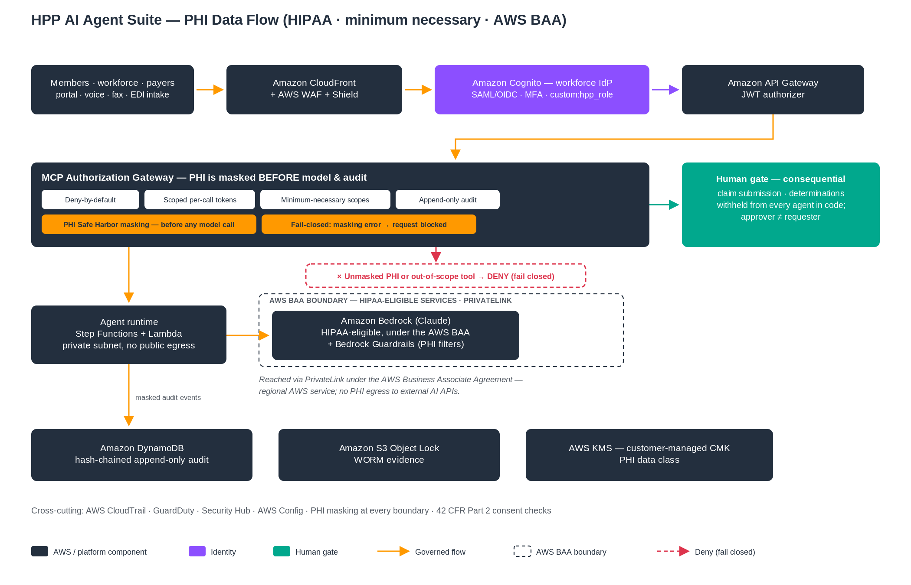

# HPP AI Agent Suite

> ⚠️ **Before you cite anything here:** read [**What we will *not* claim**](NOT-CLAIMS.md) — this is an independent reference accelerator that runs on AWS. It is **not** an AWS service, **not** AWS-supported, **not** an official AWS solution, and **not** a compliance certification. That page governs if any wording elsewhere reads stronger.

> 📊 **Honest status, one source of truth:** per-agent maturity, clean-account evidence, connector tiers, and the test count live in machine-readable [`MATURITY.yaml`](MATURITY.yaml); the four connector-maturity terms are defined in [`docs/CONNECTOR-MATURITY.md`](docs/CONNECTOR-MATURITY.md). Prose defers to `MATURITY.yaml`; a portfolio drift-checker (`tools/check_maturity.py`) keeps them aligned.

> 🔗 **Conforms to the Aegis Governance Pattern (AGP) v1.0.** The 8 required controls (identity, deny-by-default gateway, least-privilege intersection, bound SoD approval, fail-closed masking, append-only+WORM audit, token budgets, model gateway+grounding) are mapped to their implementing module and proving test in [`AGP-CONFORMANCE.md`](AGP-CONFORMANCE.md).

> ™ **Brand & trademark:** collateral follows two tracks — an **internal-AWS** track (approved templates only) and a **customer-safe public** track (neutral branding, plain-text "Built on AWS", no AWS logo). Rules in [`BRAND-AND-TRADEMARK.md`](BRAND-AND-TRADEMARK.md). Nothing here implies AWS sponsorship or endorsement.

> 🧭 **Part of the governed-agent portfolio.** This pack conforms to the **Aegis Governance Pattern (AGP v1.0)**; **Aegis** (`aegis-ai-governance-platform-aws`) is the hub — see its `PORTFOLIO-START-HERE.md` (how the packs flow together) and `DEPLOY-EVERYTHING.md` (deploy everything end-to-end). Hero reviewer pack: [`01-revenue-cycle-denial-agent/ASSURANCE-PACKET.md`](01-revenue-cycle-denial-agent/ASSURANCE-PACKET.md) · [`PILOT-SOW`](01-revenue-cycle-denial-agent/PILOT-SOW.md).

> 📚 **Governance & readiness docs (this repo):** [`NOT-CLAIMS`](NOT-CLAIMS.md) · [`MATURITY.yaml`](MATURITY.yaml) · [`Connector maturity`](docs/CONNECTOR-MATURITY.md) · [`AGP conformance`](AGP-CONFORMANCE.md) · [`Operating model`](OPERATING-MODEL.md) · [`Release packet`](RELEASE-PACKET.md) · [`AWS run-cost`](AWS-RUN-COST.md) · [`Brand & trademark`](BRAND-AND-TRADEMARK.md)
### Governed AI Agents for Health Providers & Plans — Built on AWS

[](.github/workflows/ci.yml)

> **The agents are not the product. The governance that makes them deployable, auditable, and HIPAA-defensible is.**

A **reference accelerator** of **8 governed healthcare AI agents** — each a standalone reference
architecture (own VPC, identity, data, and audit stack) — plus an optional **Care & Claims
Orchestration Platform** that coordinates them across a patient/member journey. A **no-API-key
automated test suite (268 tests green as of 2026-07-10)** exercises the control plane, including negative-case tests for
cryptographic JWT verification, bound single-use approvals, the tamper-evident audit chain, and
fail-closed PHI masking. Every external figure is evidence-tiered in `SOURCES.md` /
`gtm/HPP-DECK-SOURCES.md`.

> **Status & maturity (read first).** This is a **reference accelerator for discovery, architecture
> workshops, and scoped pilots — not an AWS-authorized, HITRUST-certified, production-ready system.**
> All 8 agents are deployable via CloudFormation (cfn-lint clean) and Terraform; inference is
> in-account on **HIPAA-eligible Amazon Bedrock under an AWS BAA**; the human gate is real
> (framework-enforced, bound approvals). **Live system-of-record connectors, IdP integration,
> penetration testing, and HITRUST/SOC 2 authorization are customer-engagement work.** See
> `docs/PRODUCTION-READINESS-AND-SHARED-RESPONSIBILITY.md` (gap assessment + RACI).

## Capability maturity matrix

✅ = evidence in this repo (code + tests, or the documented live AWS validation) · ◻ = not done here / engagement work.
Live-AWS cells reflect the 2026-06-29 validation-account run of the Agent 01 golden path (stack `hpp-gp01-acc`: deploy → acceptance test → teardown); the other agents share the same templates but were not individually stood up.

| Capability | Designed | Implemented (offline/tested) | Deployed on AWS (validated) | Integration-tested on AWS | Production-ready | Owner (Repo/Customer) |
|---|:--:|:--:|:--:|:--:|:--:|---|
| Identity / authN | ✅ | ✅ | ◻ | ◻ | ◻ | Repo (JWT verification unit-tested; SAML/OIDC IdP federation addon: `infra/cloudformation/idp-federation.yaml` + `docs/IDP-FEDERATION-RUNBOOK.md`; live IdP integration: Customer) |
| MCP / tool authorization gateway | ✅ | ✅ | ✅ | ✅ | ◻ | Repo (golden-path scope, Agent 01) |
| Policy enforcement (deny-by-default) | ✅ | ✅ | ✅ | ✅ | ◻ | Repo (acceptance test: read ALLOW, gated write PENDING) |
| Human approval (SoD, single-use) | ✅ | ✅ | ✅ | ◻ | ◻ | Repo (gate proven to hold live; full approve/resume verified offline) |
| PII/PHI masking | ✅ | ✅ | ◻ | ◻ | ◻ | Repo (fail-closed masking unit-tested; not runtime-verified on AWS) |
| Audit (append-only + WORM) | ✅ | ✅ | ✅ | ✅ | ◻ | Repo (append-only audit written live; WORM Object Lock ships in `infra/cloudformation`, not runtime-validated) |
| Bedrock + Guardrails | ✅ | ✅ | ◻ | ◻ | ◻ | Repo (Guardrail templates cfn-lint clean; live invocation not asserted in the validation run) |
| IaC deploy (golden path) | ✅ | ✅ | ✅ | ✅ | ◻ | Repo (Agent 01 SAM golden path; agents 02–08 deployable, not individually validated) |
| Live connectors | ✅ | ✅ | ◻ | ◻ | ◻ | Customer (fixtures + a local live-HTTP reference; Epic/Availity/payer FHIR are engagement work) |
| CI/CD | ✅ | ✅ | ◻ | ◻ | ◻ | Repo (`.github/workflows/ci.yml`: tests + security + IaC lint; no cloud deploys in CI) / Customer |
| Monitoring / alerts | ✅ | ◻ | ◻ | ◻ | ◻ | Customer |
| DR / backup | ✅ | ◻ | ◻ | ◻ | ◻ | Customer |
| Compliance evidence | ✅ | ✅ | ◻ | ◻ | ◻ | Repo (NIST 800-53 matrix, control mappings) / Customer (HITRUST/SOC 2 evidence) |

Nothing in this repository is production-certified; see `docs/PRODUCTION-READINESS-AND-SHARED-RESPONSIBILITY.md` for the full RACI.

*Governance once, agents as add-ons: `platform_core` (`hpp-agent-platform` 0.1.0) **implements the Aegis Governance Pattern (AGP) v1.0** — the shared governance contract defined in the Aegis platform repo (`docs/14-GOVERNANCE-PATTERN-VERSIONING.md`). Conformance is declared in `platform_core/hpp_agent_platform/__init__.py` (`AEGIS_GOVERNANCE_PATTERN_VERSION`) and asserted by `platform_core/tests/test_agp_conformance.py`.*

> **Validation update (2026-07-10).** The `hpp-gp01-acc` golden-path acceptance run was independently re-verified (CloudTrail, KMS deletion marker), and the run's Object-Locked WORM audit records are **still inspectable** — S3 Object Lock blocked the bucket's deletion at teardown, so the control demonstrated itself; the bucket is deliberately retained as tamper-proof evidence. Offline suite: 268 tests green. Sanitized proof pack: [`evidence/CLEAN-ACCOUNT-ACCEPTANCE.md`](evidence/CLEAN-ACCOUNT-ACCEPTANCE.md).

---

### Hero pilot — Revenue-Cycle Denial Drafting (Agent 01)

**Denial appeal drafting is the lead, low-blast-radius pilot.** The agent *reads* a claim/denial,
*classifies* the root cause, and *drafts* a grounded appeal — it **never submits a claim or an
appeal**; a biller/denials specialist does, through the human gate. That keeps the blast radius small
while the payback (denials are a **~$18B/yr** rework cost) is large.

It now ships with a **scored quality benchmark**, not just structural checks. The scored eval
([`governance/evals/score_denial.py`](governance/evals/score_denial.py)) runs the **real Agent 01
classifier** (`agent/nodes.analyze_denial`) over **20 labeled synthetic denial cases** and gates on
regulatory-weighted thresholds — **CI fails the build on any miss**:

| Metric | Threshold | Why |
|---|---|---|
| Denial-reason classification accuracy (CARC/RARC-family) | ≥ 0.90 | correct root cause |
| **Recoverable-vs-write-off recall** | **≥ 0.95** (weighted highest) | **missing a recoverable denial is a wrongful write-off — the money harm** |
| Entity F1 (claim_id · payer · denial_code · service) | ≥ 0.85 | extraction fidelity |
| Appeal-draft grounding rate | ≥ 0.90 | no fabricated codes/amounts (reuses `governance/grounding.py`) |
| **PHI-leak rate** | **== 0 (HARD GATE)** | masker strips structured Safe-Harbor identifiers before emit/audit; free-text names need the NER engine, mandatory in real-data mode (`ALLOW_REAL_DATA`) |
| Appeal completeness | ≥ 0.95 | required fields present (presence, not truthiness) |
| Duplicate accuracy | ≥ 0.90 | duplicate-vs-near-miss discrimination |

Report: [`governance/evals/eval-report-denial.md`](governance/evals/eval-report-denial.md) ·
run it: `make eval-denial` · CI: the `evals` job in [`.github/workflows/ci.yml`](.github/workflows/ci.yml).

**Honest framing on data.** Unlike an open public dataset, there is **no clean public, PHI-free
denial API** — real denial data is the customer's **X12 835/277** remittance (via a clearinghouse) or
**AWS HealthLake Claim/ClaimResponse (FHIR)**, both **PHI-bearing and under a BAA**. The benchmark
therefore runs on **labeled synthetic denials**, and the connector scaffold
([`platform_core/hpp_agent_platform/connectors/denials.py`](platform_core/hpp_agent_platform/connectors/denials.py))
follows the same governed interface: **fixture mode** returns the synthetic cases offline; **live mode
raises a clear `NotImplementedError` pointing to the X12/HealthLake source** (engagement work — not
stubbed against a fake endpoint); and **writes (claim resubmission, appeal submission) always raise —
submission is human-gated.**

---

### Canonical deployment path

**The one supported, acceptance-gated deploy path is the Agent 01 golden path — [`infra/golden-path-01-revenue-cycle/`](infra/golden-path-01-revenue-cycle/)** (SAM: `./build.sh && sam deploy --guided && ./smoke_test.sh`) — the only path that has been through the clean-account acceptance gate. The nested CloudFormation suite in [`infra/cloudformation/`](infra/cloudformation/) is an **alternative multi-agent reference (not acceptance-gated)**, and [`infra/terraform/`](infra/terraform/) is a near-parity reference (coverage matrix: [`docs/TERRAFORM-AND-GOVCLOUD-STATUS.md`](docs/TERRAFORM-AND-GOVCLOUD-STATUS.md)). Validation evidence: [`evidence/CLEAN-ACCOUNT-ACCEPTANCE.md`](evidence/CLEAN-ACCOUNT-ACCEPTANCE.md).

## ▶ Start here — what to read first
1. **`GETTING-STARTED.md`** — prove the flagship agent on your laptop (no API key), run the
   268-test suite (see `MATURITY.yaml`), then deploy into a new AWS account.
2. **`docs/PRODUCTION-READINESS-AND-SHARED-RESPONSIBILITY.md`** — honest gap assessment + RACI.
3. **The security package** — `SECURITY.md`, `docs/THREAT-MODEL.md`,
   `docs/NIST-800-53-CONTROL-MATRIX.md`, `docs/OWASP-LLM-ATLAS-MAPPING.md`,
   `docs/INCIDENT-RESPONSE-AND-KEY-MANAGEMENT.md`.
4. **`infra/golden-path-01-revenue-cycle/`** — the canonical one-command deploy; `docs/DEPLOY-QUICKSTART.md` covers the alternative nested-CloudFormation reference (not acceptance-gated).

**I want to…** see it / pitch it → `decks/` (11 decks) + `decks/leave-behinds/` (one-pagers) +
`gtm/SELLER-SA-FIELD-GUIDE.md` · deploy → **one command (canonical)**: `infra/golden-path-01-revenue-cycle/` (SAM); alternative multi-agent reference: `docs/DEPLOY-QUICKSTART.md` + `deliverables/agent-handbooks/`
· review the security model → §3 + §3a + the security package · run the tests → `bash scripts/run_tests.sh`.

---

## 1. The need — what providers and health plans actually face
The blocker is not the model. It is identity, authorization, audit, PHI isolation, accessibility,
and *who has the authority to act* — before a single consequential action touches a claim, a chart,
or a coverage decision. The pain is specific, documented, and expensive:

| Workflow | The pain today (cited; evidence tier) |
|---|---|
| Revenue cycle / denials | Initial denial rate **~11.8%** and climbing; U.S. hospitals spent **~$18B** in 2025 overturning denials; **35–60%** of denials never reworked **[INDUSTRY-RESEARCH]** |
| Prior authorization | **~39 PAs/physician/week (~13 hrs)**; **94%** say PA delays care; FHIR PA APIs mandated by **Jan 1, 2027** (CMS-0057-F) **[ASSOCIATION] [GOV]** |
| Clinical administration | Ambient-AI evidence: ambulatory burnout **51.9% → 38.8%** in 30 days; **~30 min/day** documentation saved **[PEER-REVIEWED]** |
| Patient access | Outpatient no-show **23–33%**, **~$200**/missed appt, **~$150B/yr** to the U.S. system **[INDUSTRY-RESEARCH]** |
| Utilization management | One insurer's post-acute denial rate rose **8.7% → 22.7%** after an AI tool (U.S. Senate, 2024); algorithmic UM under litigation **[GOV]** |
| Payment integrity & coding | FY2025 improper payments: Medicare FFS **$28.8B**, Medicaid **$37.4B** **[GOV]** |
| Care management | A widely used risk algorithm cut Black patients flagged for extra care by **>half** (Science, 2019) **[PEER-REVIEWED]** |
| Member services | A healthcare live-agent call costs **~$25–$35**; AI deflects **~45%** of routine queries **[INDUSTRY-RESEARCH]** |

Adoption signal: **>80% of health systems and 70% of health plans are prioritizing agentic AI**
(Deloitte, Sep 2025) **[INDUSTRY-RESEARCH]**. Full citations: `gtm/HPP-DECK-SOURCES.md`.

---

## 2. How this solves it
**8 governed agents**, each a runnable workflow (intake → gather evidence → draft/assemble → compliance
check → **human gate** → finalize), every system touch flowing through a deny-by-default gateway:

| # | Agent | What it does | Human gate · the bright line |
|---|---|---|---|
| **01** | Revenue-Cycle & Denial | Classifies denials, drafts grounded appeals | Denials Specialist · **never submits a claim** |
| **02** | Prior-Authorization | Da Vinci requirement check, assembles + submits PA | PA Nurse · **coverage determination is the payer's** |
| **03** | Clinical-Administration | Chart-grounded summaries, notes, discharge | Clinician sign-off · **draft only, no order entry** |
| **04** | Patient Access | Eligibility, deterministic Good Faith Estimate, scheduling | Access Rep · **estimate is deterministic, not LLM; identity-gated** |
| **05** | Utilization Management | MCG/InterQual criteria + fairness screen → recommendation | Medical Director · **issue_determination withheld from ALL agents; never auto-denies** |
| **06** | Payment Integrity & Coding | NCCI/MUE, upcoding/duplicate detection | Reviewer · **flags only — no recoupment or submission** |
| **07** | Care Management & Pop Health | Care gaps + HCC/RAF + SDOH + fairness screen | Care Manager · **risk never assigned autonomously** |
| **08** | Contact Center / Member Services | Claim status/benefits on Amazon Connect; grievances | Member-Services Rep · **identity-gated; cannot submit an appeal** |

**The controls that make it deployable (this is the product):**
1. **Cryptographic identity** — RS256/JWKS JWT verification with an algorithm allow-list and an
   alg-confusion guard; client-supplied roles are never trusted (`platform_core/.../jwt_verify.py`).
2. **Deny-by-default gateway, least-privilege intersection** — `permitted ⇔ agent grant ∩ user
   entitlement`; the agent can never exceed the human (`mcp_gateway/policy.py`).
3. **Consequential actions withheld in code** — submit-claim, issue-UM-determination, sign-note,
   recoup-payment are absent from the agents' grants and proven by tests.
4. **Bound, single-use, separation-of-duties approvals** — the approval token is cryptographically
   tied to the exact tool + arguments, expires, cannot be replayed, and requires reviewer ≠ requester
   (`approvals.py`).
5. **Tamper-evident audit + WORM** — hash-chained append-only records (`verify_chain`), prod
   conditional writes + IAM deny + S3 Object Lock; **PHI masked, fail-closed** at every boundary.
6. **Private-connectivity inference** — Amazon Bedrock under the AWS BAA via VPC endpoint
   (AWS PrivateLink), with mandatory Guardrails — no PHI egress to external AI APIs; traffic
   to the regional, HIPAA-eligible Bedrock service stays on AWS private networking. **Bedrock is
   the default provider**; the external Anthropic API is gated behind an explicit
   `ALLOW_EXTERNAL_LLM=1` opt-in (non-PHI/dev only), so a bare `LLM_PROVIDER` change can never
   silently send PHI off-AWS.

Plus the **Care & Claims Orchestration Platform** (`care_platform/`) — a governed saga with
compensation, an AAL-gated consent ledger (42 CFR Part 2), and a compliance event bus that ties
agents across a journey **without widening authority** (`ENTERPRISE-PLATFORM.md`).

---

## 3. Security architecture & how it satisfies the regulations

### Secure MCP gateway — how every tool call is authorized

Every agent tool call passes through an **authenticated gateway**; there is no un-gated path to a system of record. The same controls apply everywhere in the portfolio (the [Aegis Governance Pattern](the Aegis platform repo `docs/14-GOVERNANCE-PATTERN-VERSIONING.md`)):

- **Inbound authorization — JWT or IAM.** A verified Cognito/IdP **JWT** (or SigV4/**IAM**) is required on every call; identity is taken only from the verified authorizer claim, never the request body. *"No authorization" is a development/testing mode only and is never used in production.*
- **Deny-by-default policy.** A tool is callable only if it is **registered in the allow-list** and the caller's effective permission = **grant ∩ entitlement** (the agent can never exceed the human it acts for). Unregistered tool or out-of-scope data class → **deny**.
- **Human approval for consequential actions.** Consequential tools are **withheld in code** and require a **bound, single-use, separation-of-duties** approval (approver ≠ requester; replay rejected).
- **Scoped outbound authorization.** The gateway issues **short-lived, least-privilege** downstream credentials (IAM / OAuth / token-exchange / on-behalf-of), so "the agent acts only within the human's authority" holds end to end.
- **Fail-closed masking.** PHI is masked before any model or audit write; on masker failure it **redacts rather than leaks**.
- **Append-only audit + revocation.** Every decision (allow / deny / approval) is written to an **append-only** sink: records are written by conditional `PutItem` (no overwrite), IAM permits `UpdateItem` **only** on the atomic sequence-counter item and **denies** `DeleteItem` on the audit table, and finalized records stream to **WORM** S3 Object Lock evidence. Tools can be revoked / deny-listed at the registry.
- **Failure modes are fail-closed.** Missing/invalid token → **401**; unregistered tool → **deny**; missing approval → **deny**; masker or audit-write failure → **deny, not proceed**.

In deployment this is **Amazon Bedrock AgentCore Gateway** (managed) or the **portable API-Gateway-+-Cognito-JWT** path; the portable path is the supported default and the one live-validated (the Aegis platform repo, Run 10; the same portable pattern deploys here).

> **Auditors / GRC / TPRM reviewers:** the [`assurance/`](assurance/README.md) packet is a single
> curated cover sheet indexing every threat-model, NIST/HIPAA/Part-2 control-mapping, evidence,
> and shared-responsibility artifact under standard assurance headings.



The shared Aegis control-plane pattern — how every tool call is authenticated, authorized, human-approved, and audited, including the deny paths:


Editable source: the SVG in [`docs/diagrams/`](docs/diagrams/) (open in draw.io, Inkscape, or any text editor).

```
Workforce/members -> CloudFront + AWS WAF (OWASP rules, rate-limit) + Shield
   -> API Gateway . Amazon Cognito (federates IdP -> short-lived RS256 JWT; gateway verifies it)
   -> Agent runtime (Step Functions + Lambda, or Fargate / AgentCore Runtime) in a private subnet
   -> MCP authorization gateway (re-verifies JWT + custom:hpp_role; deny-by-default; mints a scoped per-call token)
   -> Amazon Bedrock (Claude) + Guardrails via VPC endpoint (PrivateLink)  [no PHI egress to external AI APIs, under AWS BAA]
   -> DynamoDB append-only hash-chained audit . S3 Object Lock (WORM) . KMS CMK
Cross-cutting: CloudTrail . GuardDuty . Security Hub . Config . PHI masking at every boundary
```

| Regime | How it's addressed |
|---|---|
| **HIPAA Privacy/Security + AWS BAA** | Minimum-necessary at the gateway; PHI masking (Safe Harbor); hash-chained append-only audit; Bedrock via PrivateLink under BAA |
| **42 CFR Part 2** | Consent check before sensitive disclosure; AAL-gated consent ledger; escalate without consent |
| **CMS-0057-F** | Da Vinci-aligned payer connector (CRD/DTR/PAS); FHIR PA/status surfaces standardized by Jan 2027 |
| **No Surprises Act** | Deterministic Good Faith Estimate tool (never the LLM) |
| **Section 1557 / 21st Century Cures** | Health-literacy + accessibility checks on member output; EHI surfaced, never withheld |
| **CMS AI-in-UM guidance** | `issue_determination` withheld from every agent; adverse recommendation forwarded, never auto-denied; four-fifths fairness screen |
| **False Claims Act / OIG (coding)** | Payment-integrity agent flags only — no recoupment or submission |
| **NIST AI RMF / 800-53 / OWASP-LLM / MITRE ATLAS** | `governance/`, `docs/NIST-800-53-CONTROL-MATRIX.md`, `docs/OWASP-LLM-ATLAS-MAPPING.md` |

Each control is **Implemented** (in the platform) or **Configurable** (the customer wires IdP,
connectors, Guardrail policy, retention, and owns HITRUST/SOC 2 + CSV). Machine-readable mapping:
`governance/controls/control_mappings.py`.

## 3a. For the CIO, CISO & Director of Architecture — why this clears review
The shared concern: **an AI agent that can touch systems of record is a governance, audit, and
least-privilege problem before it is a model problem.** The controls below are implemented **and
unit-tested** (not just described) — see `platform_core/tests/test_security_controls.py`.

**CISO — concerns and how they're alleviated**
- *"Could the AI take a consequential action on its own?"* No. Submit-claim / issue-determination /
  sign-note / recoup are **withheld from the agent in code** and verified by tests; they execute only
  after a **bound, single-use, separation-of-duties** approval (approver ≠ requester; the token is
  cryptographically bound to the exact tool + arguments, expires, cannot be replayed).
- *"Can I trust the identity and roles?"* Identity is **cryptographically verified** (RS256 over the
  Cognito JWKS, with issuer/audience/expiry checks and an **alg-confusion guard** that rejects
  `none`/`HS*`); client-supplied roles are never trusted. Authorization is **deny-by-default with
  least privilege as an intersection**.
- *"Will the audit trail hold up?"* It is **append-only and hash-chained** (`verify_chain` detects any
  alteration), with **WORM (S3 Object Lock)** retention and **PHI masking that fails closed**. Every
  attempt — allow, deny, pending-approval, error — is recorded with lineage.
- *"Where does the data go?"* Inference stays **in-account** (Bedrock via VPC endpoint, under the AWS
  BAA) with **Guardrails on input and output**. Mapping: `docs/NIST-800-53-CONTROL-MATRIX.md`; abuse
  cases: `docs/THREAT-MODEL.md`; LLM risks: `docs/OWASP-LLM-ATLAS-MAPPING.md`.

**Director of Architecture** — one governed pattern reused across eight agents: edge (CloudFront +
WAF + Shield) → Cognito JWT → API Gateway → MCP gateway (deny-by-default + scoped per-call token) →
Bedrock + Guardrails → human gate → append-only WORM audit. Full **IaC parity** (CloudFormation +
Terraform), per-agent isolation (own VPC/KMS/Cognito/audit), native (Step Functions
`waitForTaskToken`) or container (Fargate). Readable Python, standard AWS services — no black box.

**CIO** — build the governance once and every future agent inherits it. Start with a low-blast-radius
agent (Patient Access or Member Services), prove value against documented outcomes (§2), and scale on
a paved road to compliant production. The honest gap assessment (§5) means no surprises in review.

Monthly run-cost model (pilot vs production): [`offerings/TCO-MODEL.md`](offerings/TCO-MODEL.md)

> **For assessors:** the security package maps every claim above to a testable control or a named
> owner — `SECURITY.md`, `docs/THREAT-MODEL.md`, `docs/NIST-800-53-CONTROL-MATRIX.md`,
> `docs/OWASP-LLM-ATLAS-MAPPING.md`, `docs/INCIDENT-RESPONSE-AND-KEY-MANAGEMENT.md`.

---

## 4. How to position it
- **Standalone first, platform when ready.** Start with the canonical golden path
  (`infra/golden-path-01-revenue-cycle/`); for multi-agent scale-out, `scripts/deploy.sh <agent>`
  stands up a complete isolated stack per agent with **no platform dependency**
  (`docs/DEPLOYMENT-MODELS.md`, alternative reference — not acceptance-gated). Grow agent by agent;
  the orchestration platform is additive.
- **Sellers & SAs:** `gtm/SELLER-SA-FIELD-GUIDE.md` (phased playbook + CISO security-review checklist),
  `gtm/SELLER-FIRST-MEETING-CHEATSHEET.md`, `gtm/HPP-PLATFORM-GTM-STORY.md`.
- **Decks (`decks/`):** 8 per-agent narrative decks (issue → cost → what customers see → how the
  market solves it → how we solve it → why defensible) + an executive overview + a CISO/CMIO review +
  the orchestration-platform deck, each with the an optional logo (internal-track only) and grounded, cited figures.
  One-page **leave-behinds** in `decks/leave-behinds/`.

## 5. Production readiness — and who owns what
**Honest status: a production-shaped accelerator, not an authorized, production-ready system — and it
doesn't claim to be.** Verifiable today: consequential actions withheld in code + tested · framework-
enforced human gate · cryptographic JWT verification · bound single-use SoD approvals · hash-chained
append-only audit + WORM with IAM-enforced immutability (conditional `PutItem`, `DeleteItem` denied)
and split audit/approval signing secrets · PHI masking (fail-closed; NER mandatory in real-data mode) ·
pinned dependency lockfiles with blocking pip-audit · complete AWS security architecture · no lock-in · a 263-test
no-API-key suite incl. control-plane negative cases. Still required before go-live: **AWS BAA**, live
connectors, IdP integration, Guardrail/red-team tuning, CSV/CSA validation, penetration test, DR game
day, HITRUST/SOC 2. **Full gap assessment + 15-row RACI + gated go-live checklist:**
`docs/PRODUCTION-READINESS-AND-SHARED-RESPONSIBILITY.md`.

## What this is — and what it is not
| This is | This is not |
|---|---|
| A governed, auditable **accelerator** with the hard controls built in and tested | A certified, HITRUST'd SaaS product you deploy unchanged |
| A reference architecture + IaC you deploy into your account and **own** | A black-box dependency or turnkey integration |
| Decision-support — drafts, assembles, flags, recommends — humans decide | Autonomous decisioning in clinical or coverage workflows |
| Demonstrated + Deployable-by-design (no-API-key tests incl. control-plane negative cases) | Production-ready until the go-live checklist is met |

## Repository map
```
README.md  GETTING-STARTED.md  ENTERPRISE-PLATFORM.md  SECURITY.md  SUITE-STATUS.md  SOURCES.md
CHANGELOG.md  VERSION  CONTRIBUTING.md  Makefile
01-..08-*-agent/                       # 8 agents (code, tests, docs, deploy runbook, deck)
platform_core/hpp_agent_platform/      # gateway, jwt_verify, approvals, audit(+sinks), masker, LLM factory, connectors, A2A
care_platform/hpp_care_platform/       # govern, canonical, consent, saga, events, journeys (orchestration platform)
governance/                            # grounding, prompts, evals, red team, fairness, accessibility, controls
aws-native-reference/                  # Step Functions rebuilds (per agent + care-platform)
infra/golden-path-01-revenue-cycle/    # CANONICAL: one-command SAM deploy + smoke_test.sh + teardown.sh (GOLDEN-PATHS.md)
infra/cloudformation/  infra/terraform/  # Alternative multi-agent reference (not acceptance-gated) + Terraform parity
docs/                                  # architecture, security package, deployment models, control mappings, deploy-quickstart
gtm/  decks/  offerings/  runbooks/  deliverables/   # GTM, decks(+leave-behinds), offerings, ops runbooks, agent handbooks
.github/workflows/ci.yml               # CI: tests + security + IaC lint
```

## Quick start
```bash
pip install -e platform_core && pip install langgraph streamlit cryptography
bash scripts/run_tests.sh                                    # 268 tests, no API key
cd 01-revenue-cycle-denial-agent && EXTRACT_MODE=demo python demo/demo_run.py        # fixtures
EXTRACT_MODE=demo python demo/demo_live.py                                            # LIVE HTTP connector path (no API key)
cd .. && PYTHONPATH=platform_core:care_platform python aws-native-reference/care-platform/local_runner.py  # orchestration journeys

# Deploy to a new AWS account — one command (canonical golden path):
cd infra/golden-path-01-revenue-cycle && ./build.sh && sam deploy --guided && ./smoke_test.sh
# alternative multi-agent reference (nested CloudFormation, not acceptance-gated): docs/DEPLOY-QUICKSTART.md
```

## Compliance disclaimer
A **decision-support accelerator** for qualified healthcare professionals — not a certified system, a
medical device, or an approved coverage/billing tool. AI-generated content requires human review
before any consequential action — submitting a claim or appeal, issuing a coverage determination,
signing a clinical note, or closing a case; the AI never takes irreversible action autonomously.
Customers own the AWS BAA, IdP integration, connector validation, Guardrail configuration, retention
schedule, CSV/CSA for the intended use, and HITRUST/SOC 2 authorization. See
`docs/PRODUCTION-READINESS-AND-SHARED-RESPONSIBILITY.md`.